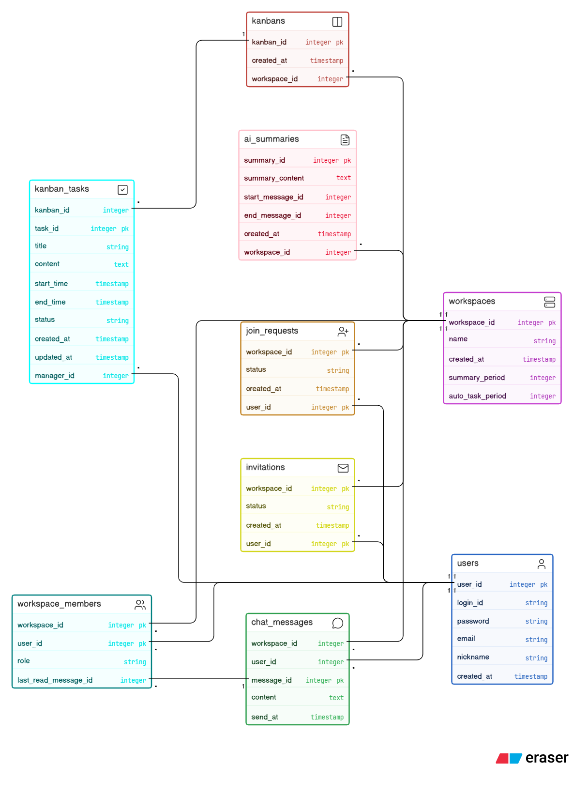

# 💬 Fask: AI 회의록 및 태스크 관리 채팅 툴
> **AI 대화 내용 분석을 통한 요약본 및 칸반 보드 자동 생성을 목표로 하는 실시간 협업 워크스페이스**

 

## 📅 프로젝트 개요
* **개발 기간:** 2026.03.14 ~ 2026.07.08
* **참여 인원:** 4인 (Backend 2, Frontend 2)
* 
---

## 📝 한 줄 요약
**"회의는 짧게, 실행은 확실하게"** 
팀 대화(회의) 내용을 AI가 분석해 자동으로 요약본과 칸반 보드를 생성해주는 **실시간 협업 채팅 & 태스크 관리 툴**입니다.

---

## 📸 주요 화면 미리보기 (Preview)
**실시간 채팅, AI 회의록 요약, 칸반 보드 화면입니다.**

| **실시간 채팅** |
| :---: |
|  |

| **AI 회의록 요약** |
| :---: |
|  |

| **칸반 보드** |
| :---: |
|  |

---

## 🚀 기획 배경 및 목표
**Fask**는 팀 프로젝트나 협업 과정에서 반복되는 "회의는 했는데 정리가 안 되고, 정리는 됐는데 태스크로 이어지지 않는" 문제를 해결하기 위해 기획되었습니다.

### 1. 문제점
* **회의록 정리 부담:** 회의 내용을 별도로 정리하는 데 시간과 인력이 소모됨.
* **협업 툴 분산:** 채팅, 회의록, 태스크 관리 툴이 따로 놀아 정보가 여러 곳에 흩어짐.

### 2. 해결책
* **AI 기반 자동 요약:** 실시간 채팅/회의 내용을 AI가 분석해 핵심 내용을 자동 요약.
* **원스톱 워크스페이스:** 대화, 회의록, 태스크 관리를 하나의 채팅 툴 안에서 처리.

### 3. 기대 효과
* **정리 시간 절감:** 회의 후 수기로 정리하던 시간을 최소화.
* **투명한 협업:** 팀원 모두가 같은 정보와 진행 상황을 실시간으로 공유.

---

## 🛠 사용 기술 (Tech Stack)

### Frontend
| 구분 | 기술 스택 | 비고 |
| :--- | :--- | :--- |
| UI 프레임워크 |  | |
| 번들러 |  | |
| 스타일링 |  | |
| 실시간 통신 |  | |
| 마크다운 렌더링 | react-markdown 10.1.0 | AI 요약 결과 렌더링 |

### Backend
| 구분 | 기술 스택 | 비고 |
| :--- | :--- | :--- |
| 런타임 |  | |
| 프레임워크 |  | |
| 실시간 통신 |  | |
| 데이터베이스 |  | mysql2 3.20.0 |
| AI 연동 |  | gemini-3.1-flash-lite |

### Collaboration
| 구분 | 기술 스택 | 비고 |
| :--- | :--- | :--- |
| 형상관리 |   | |

---

## ✨ 핵심 구현 기능

### Frontend
1. **실시간 협업 (Socket.IO)**
   워크스페이스 채널 구독 및 실시간 메시지 수신, 채팅 패널이 닫혀 있을 때 미읽음 카운터 자동 증가
2. **칸반 드래그&드롭**
   HTML5 DnD API 기반 태스크 상태 변경, 낙관적 UI 업데이트 후 API 실패 시 자동 롤백
3. **커서 기반 무한 스크롤 채팅**
   한 번에 30개씩 커서 기반 페이지네이션, 메시지 전송 시 낙관적 업데이트 후 서버 응답으로 실제 ID 교체
4. **AI 요약 마크다운 렌더링**
   react-markdown으로 AI 요약 결과 렌더링, 요약 생성 중 버튼 비활성화 및 로딩 상태 표시
5. **권한 기반 UI**
   방장/멤버 권한에 따라 워크스페이스 설정 접근 제어, 사이드바에 방장 뱃지 표시

### Backend
1. **워크스페이스별 소켓 룸 구조**
   유저 연결 시 개인 룸(`user_{userId}`)에 자동 입장, 워크스페이스 입장 시 별도 룸(`workspace_{workspaceId}`) 참여/퇴장 이벤트 처리
2. **안읽음 메시지 실시간 브로드캐스트**
   메시지 전송 시 방 안 멤버에게는 `new_message`, 방 밖 멤버에게는 각자의 안읽음 개수를 계산해 개인 룸으로 `unread_update` 전송
3. **AI 기반 증분 요약**
   마지막 요약 이후 새로 쌓인 메시지만 조회해서, 이전 요약 + 새 메시지를 함께 프롬프트에 넣어 Gemini로 갱신된 요약본 생성
4. **칸반 상태 기반 태스크 관리**
   `status` 필드 기반 태스크 생성/조회/수정 API 제공 (수동 CRUD)
5. **레이어드 아키텍처**
   `routes → controller → service → model` 구조로 관심사 분리, 에러는 `statusCode`를 붙여 throw하고 컨트롤러에서 일괄 처리

---

## 👥 Team Members & Roles

| 이름 | 포지션 | GitHub |
| :--- | :--- | :--- |
| **유지환** | `Team Leader` `Backend` | [@angry-cat55](https://github.com/angry-cat55) |
| **유태식** | `Backend` | [@xotlr467-cpu](https://github.com/xotlr467-cpu) |
| **신재영** | `Frontend` | [@NKIA-SJY](https://github.com/NKIA-SJY) |
| **전현서** | `Frontend` | [@aihonte](https://github.com/aihonte) |

---

## 📂 산출물

### 1. API 명세서
* [📂 API_Specification.docx](./docs/API_Specification.docx)

### 2. ERD

---

## 💡 회고
*(팀원별 회고 작성 예정)*

### 📈 성과 및 배운 점
*(프로젝트 최종 완료 후 작성 예정)*
